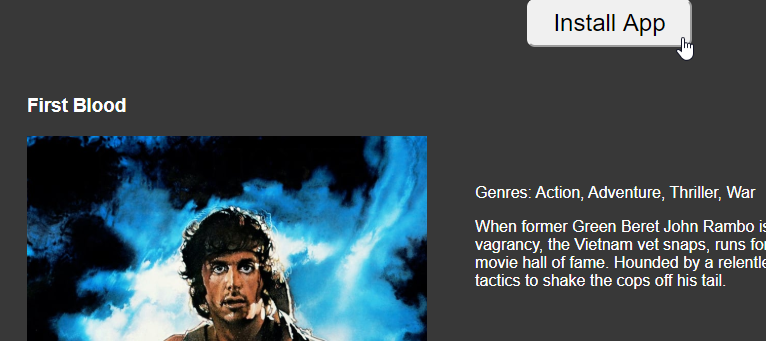
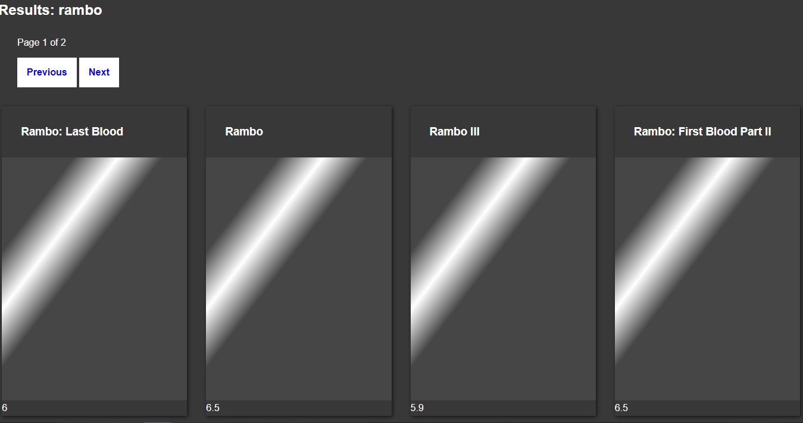
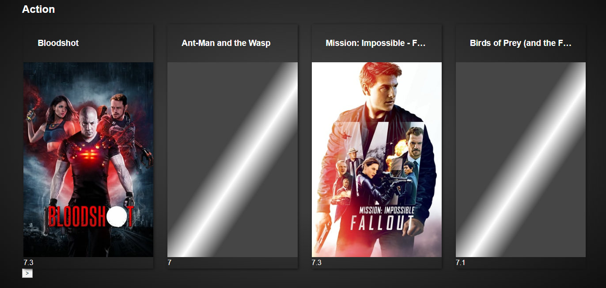
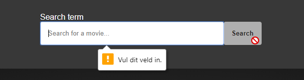
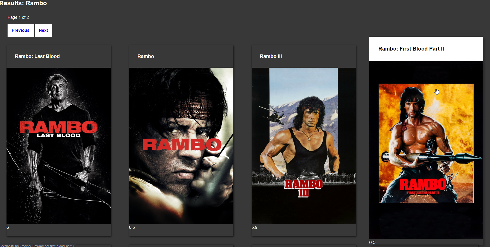

This product uses the TMDb API but is not endorsed or certified by TMDb.

### Demo: https://pwa-tomas.herokuapp.com/


## Table of contents
* [Description](#description)

## Questions for feedback 20-03-2020 (NL)
1. Ik weet dat we het maandag over TTFB gaan hebben, maar ik was er zelf al mee bezig geweest.
Ik ging kijken naar het verschil tussen de performance van een "at-runtime" gerenderde pagina en een statische pagina. Maar verder dan dat keek ik of er een verschil zou zitten in express sendFile() en het weghalen van de route en om te zorgen dat static map de overview.html zou pakken. 

Het verschil in perfomance is groot tussen een prerendered pagina en een pagina die nog moet renderen. Een laatste test op mijn localhost wijst het volgende uit:**

Render at-runtime (die nog met res.render() gerendered moet worden bij binnenkomst gebruike:

```ttfb: 165ms```

Serving static file: 

```ttfb: 1.40ms```

**Vraag:** Heroku is geen dedicated server en valt af en toe in slaap en heeft over het algemeen überhaupt al heel veel invloed op de ttfb tijd. **Hoe kan ik dit verbeteren op Heroku? Zijn er alternatieven die aan te raden zijn? Ik kreeg al een tip van Robin over een persoon online, die om het half uur een sneaky request doet naar Heroku.**

2. Ik ben trots op het feit dat ik mijn pagina's statisch kan renderen. Ik wilde eerst alle pagina's statisch renderen maar er zijn zo'n 150.000 films geloof ik. Dus Declan vertelde dat ik het principe snap en dat ik als voorbeeld maar lekker mijn overview pagina moet prerenderen. Ook ben ik trots op de share button (die ik nog goed moet implementeren, maar het werkt) en de beforeinstallprompt om de enige kans voor een install popup later in te zetten voor een mogelijk grotere kans tot actie van de gebruiker.

3. Ik ben bezig met het onderzoeken hoe ik een soort cronjob kan draaien voor het builden van mijn home pagina. Maar ik kom er nog niet helemaal uit. **Heeft iemand daar tips over? Ik heb naar de Heroku Scheduler gekeken.** Maar ik ben een beetje terughoudend als ik kijk pricing. Zijn er alternatieven?


# Description


## How to install
To install this webapp, you only have to clone this repository by entering the following command in your terminal:

```git clone https://github.com/TomasS666/progressive-web-apps-1920.git```

or this command if you want to clone the repo into your current folder:

```git clone https://github.com/TomasS666/progressive-web-apps-1920.git ./```

or you can download the zip file or something similar by clicking on the green button on the top-right position of every repo.


## Concept


## API TheMovieDB
Update on new data will follow soon!
I'm fetching data on the following endpoints:

To get a list of movies of a certain genre:
```
/discover/movie/with_genre={id}
/movie/{id}
```

### Used data
I'm fetching movies by genre. Within the render of the genres with movies I apply a ```#movie/{id}``` to anchors around the movie wrapper. When the user clicks on a movie, my router takes the id param and uses it to fetch the movie data itself on the server. With that data I render a detail-page.

## Data manipulation
I made a cleanup pattern which takes the data and an array with the desired fields with the help of Guido and Kris. Right now I'm commented out for development purposes.

### Limit
The rate limit has been removed. Yet after some time I retrieved the data of a genre and I saved it locally temporarily so I wouldn't overload the server of such a nice company. 

## Features
Searching movies
Overview page of movie genres
Single page detail page
Search results view

## Micro features / interactions
* Custom scrollbar
* Grid horizontal scroll on smaller devices
* Preload skeleton layout for images is kinda introduced right now, but needs to be refactored.

## Wishlist
* Keeping track of history enable the user to pick up where they left of.
* Pagination ( Will soon arrive )
* Better flow of data
* ~Less cascading functional code, more human readable code ( export functions in a covering parent object )~

## Known bugs
* ~Layout breaks a bit sometimes on mobile. That's because of some design choices which I have to review right now.~ resolved almost completely
* ~Missing navigation~ added at least a button to the overview page
* Image reflow taking place on detail-page, due to a different HTML structure, aware of that.

## Future features
I've gotten in to the shadow dom way too late, but better late than never. I was very eager to apply this system with actual webcomponents into my web-app, but due time I have to keep my hands of it and finish the foundation I've been working on.

## Acknowledgements
Robin Stut for feedback, help and tips in general and resources for keeping Heroku alive and not sleeping.
Declan Dek for giving me great feedback, helping me with with a better understanding of performance and what I will achieve using a partial static generated application. Also with helping Ramon and me out with the service worker. Disclaimer: example of Declan is used for now (testing and getting a better understanding), but since I probably need another caching strategy and now I understand it better, I'm gonna update that code to a flavour for my own.

## Used dependencies

### Transpiling to ES5
@babel/core: 7.9.0  
@babel/preset-env: 7.9.0  
babel-loader": 8.1.0"

### CSS within Webpack
css-loader: 3.4.2  
mini-css-extract-plugin: 0.9.0

### For updating updated cached assets
serviceworker-webpack-plugin: 1.0.1

### For minifying and building and using the other plugin
webpack: 4.42.0  
webpack-cli: 3.3.10

### For hot reload
webpack-dev-server: 3.9.0

### For a mapping of hashed assets
webpack-manifest-plugin: 2.2.0


## Proces

#### What I've learned as a person / developer / designer
Of course this course and the road you travel on is for learning new things. If I knew everything at the start, what would be left to learn? Fortunately I learned that you can develop and design endlessly. It never actually stops. But for this course alone we had an estimated 6 days to round up. Okay yes, I've had a few hours on the weekend as well. But to get to the point: at many points I'm eager to go on, to add new features, to improve etc. But with every additional feature comes exponential complexity, documentation etc. There's simply not enough time for everything. There never will be. So I've done my best, but I "laid down my arms", I stopped at the right time to round up my documentation and to finish my other course as well. Knowing that some parts required more attention, didn't get attention, could be improved, could be better, but are good for now, since I've learned so damn much, I draw my satisfaction from the learning experience.

dat dat lijkt niet te kunnen, na veel zoeken. Webp gaat in moderne browsers efficiënter om met bandbreedte als het goed is.


### Heb css en js geminified met webpack plugins,

Html zou nog mooi zijn, build het al wel
Check of het al geminified is

Gzippen doe ik ook, ik serveer het alleen nog niet, kan ik nog even naar kijken


### SW and other enhancements

#### skipWaiting
Sw self.skipwait lukt wel met button, maar niet met showNotifcation en de afhandeling daarvan, vermoedelijk omdat ik met de verkeerde sw communiceer.

Als ux overweging kan ik misschien sws beter als popup of knop laten zien en als enhancement een notificatie als daar consent voor is gegeven.

#### Navigator share API
Als navigator share, feature detection, show share knop die de native share api gebruikt van de os zodat je films kunt delen

#### Install before prompt PWA
Installbeforeprompt, werkt lekker! Zolang de gebruiker de app niet geïnstalleerd heeft blijft de prompt triggeren als een gebruiker op de knop drukt op een detailpagina. 



#### Image reflow / image skeleton state
This is one of the things I struggled the most with. *Dislaimer:* next time I'm probably going for the padding hack which is a common way to determine a image it's ratio and adding that as a padding with some additional CSS rules so it preserves the exact space the incoming image will take.

Anyway, I started out with a CSS grid layout to touch that again as well and do some cool things with it I haven't done yet. But soon I ran into trouble and challenges arose. What if I'm autofilling the movies, but the according section title isn't aligned properly? That ment I had to include my title to the grid container. But for those who worked with flexbox and grid, you can imagine chaning the markup like that, had immediate effect on my layout. More specifically how I broke it. 

Not getting into to many details, but challenges like these came along all the time and distrupted my loading state, the spacing, layout, "skeleton" layout etc. as you can imagine.

Now I also had a different important





### Features in dept

#### Genres
Iets over async await van alle genres, wat ik heb gedaan, hoe Kris vond dat het beter kon, die aanpak pakte in mijn use case niet lekker uit en misschien was mijn oplossing dus wel geschikt, maar het zou wss beter kunnen

#### Search and results page
Disabled because not filled and field is required:


Enabled because user entered something




#### Movie detail page


#### Movie trailers
Okay nice, a movie poster, the movie genres and a description. It's a start, but it's quite boring. I wanted more. The data is so rich, and I'm only displaying this? What's more cool than seeing a live action preview of the movie? A trailer? Cool let's do it. 

And so I checked out the data and how to retrieve video material via the TMDB. Turns out they had me covered.


#### Movie Collection
Hoe films collectie erbij kwam kijken. Dat ik dat wilde laten doorlinken. Dat het uiteindelijk is gelukt. 

#### Movie Cast
Cast kwam nog om de hoek kijken. 


#### Filter
Hoe ik een mogelijke filter wilde toepassen maar dat niet meer is gelukt

### Performance

### Image optimization
At some point it felt like there had to be more to the images I was retrieving. There must be a way to enhance them right? Or not? There was a lack of understanding here maybe. I thought, since I'm not serving the images from my own server / source, I must download them and write them away to my own server, do processing, alternation, webp, etc... to be able to improve performance. I thought since I didn't serve them, I couldn't influence perfomance. But then I got some resources from Declan about the srcset and sizes features.

#### Srcset 

#### Sizes 

#### How I implemented them


Kom er uit, het werkt, maar sizes kunnen beter, begrijp dat nog niet helemaal

Heb geprobeert webp te retrieven van tmdb, maar 

#### Lighthouse Audits
Audit scores

#### Other performance tools
Hoe ik die andere performance website heb ingeschakeld. 

SendFile vs laten vallen op static map, geen verschil uiteindelijk. 

Content age in express, headers

#### Critical rendering path

### Heroku deployment pros and cons
Heroku is a really nice tool for deploying your projects! Especially because you can run your Node.js project there for free. But of course being free, comes with it's limitations. Before I dive into some challenges, I want to give a shoutout to Heroku because without it I wouldn't have been able to deploy it right away, anyway.

But no, when 

Hoe Heroku fucked, dat ik niet de hobby dyno wilde want creditcard. 


## Prerendering!
Hoe ik de render functie heb aangepakt, hoe ik dat voor alles wilde maar dat Declan zei dat ik het al laat zien als ik de overzichtpagina prerender.
Dat ik heb gekeken of ik het meer generiek kon maken. Wat mijn idee daarover was.

### Webpack in combination with building my overview page
At some point I got stuck. Webpack works perfectly, does exactly what I need, besides one thing. The order I want Webpack to run tasks in and how that clashes with my building tasks.

See it like this, when my code is updated and I run the build command, Webpack gets every file I imported into my entry file (index.js) and puts them with according name and hash into my build folder, minified, compressed and well. Alongside with the build files an additional manifest.json file gets created to map the file references in my HTML to the newly created hashed files.

But this way, I have to build my HTML afterwards in order to have the right references. So you can do a post-build proces right? Yes that's my current approach. But unfortunately I haven't found a way yet to do additions and alternation to my HTML after this with Webpack. So that's something to take away from me. There must be a way, I tried some things, but I don't have the time to get that fixed with the risk of doing things I might regret.


## License

[MIT License Copyright (c) 2020 Tomas S](https://github.com/TomasS666/web-app-from-scratch-1920/blob/master/LICENSE)
