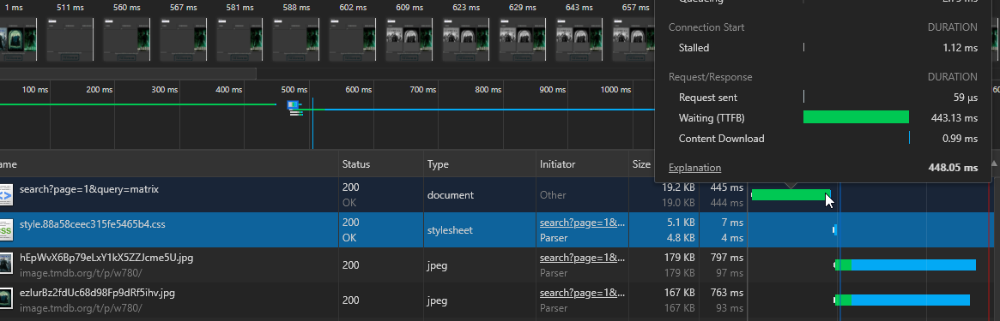
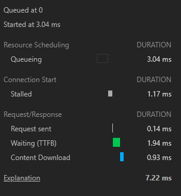
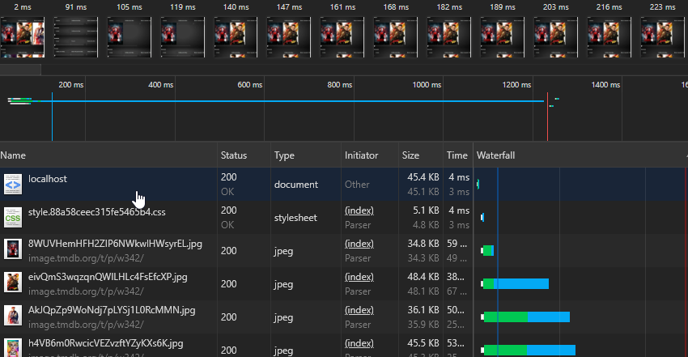
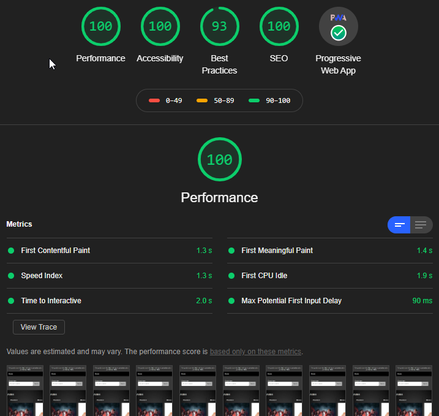
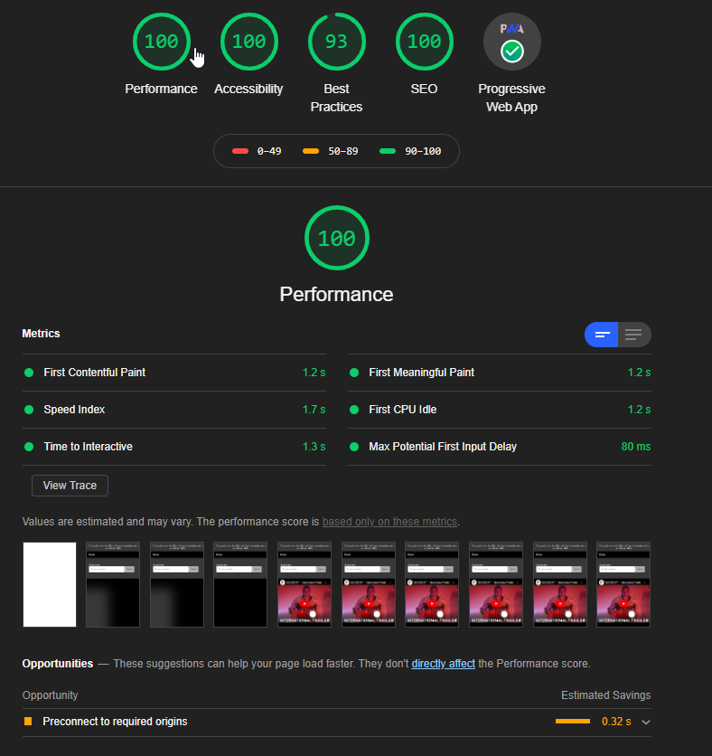

This product uses the TMDb API but is not endorsed or certified by TMDb.

### Demo: https://pwa-tomas.herokuapp.com/


## Table of contents
    + [Demo: https://pwa-tomas.herokuapp.com/](#demo--https---pwa-tomasherokuappcom-)
  * [Table of contents](#table-of-contents)
  * [Questions for feedback 20-03-2020 (NL)](#questions-for-feedback-20-03-2020--nl-)
- [Description](#description)
  * [How to install](#how-to-install)
  * [Concept](#concept)
  * [API TheMovieDB](#api-themoviedb)
    + [Used data](#used-data)
  * [Data manipulation](#data-manipulation)
    + [Limit](#limit)
  * [Features](#features)
  * [Micro features / interactions](#micro-features---interactions)
  * [Wishlist](#wishlist)
  * [Known bugs](#known-bugs)
  * [Future features](#future-features)
  * [Acknowledgements](#acknowledgements)
  * [Used dependencies](#used-dependencies)
    + [Transpiling to ES5](#transpiling-to-es5)
    + [CSS within Webpack](#css-within-webpack)
    + [For updating updated cached assets](#for-updating-updated-cached-assets)
    + [For minifying and building and using the other plugin](#for-minifying-and-building-and-using-the-other-plugin)
    + [For hot reload](#for-hot-reload)
    + [For a mapping of hashed assets](#for-a-mapping-of-hashed-assets)
  * [Proces](#proces)
    + [Minified CSS and JS with Webpack plugin](#minified-css-and-js-with-webpack-plugin)
    + [SW and other enhancements](#sw-and-other-enhancements)
      - [skipWaiting](#skipwaiting)
      - [Navigator share API](#navigator-share-api)
      - [Install before prompt PWA](#install-before-prompt-pwa)
      - [Image reflow / image skeleton state](#image-reflow---image-skeleton-state)
    + [Features in dept](#features-in-dept)
      - [Genres](#genres)
      - [Search and results page](#search-and-results-page)
      - [Movie detail page](#movie-detail-page)
      - [Movie trailers](#movie-trailers)
      - [Movie Collection](#movie-collection)
      - [Movie Cast](#movie-cast)
      - [Filter](#filter)
    + [Performance](#user-content-prerendering)
    + [Image optimization](#image-optimization)
      - [Srcset](#srcset)
      - [Sizes](#sizes)
      - [How I implemented them](#how-i-implemented-them)
      - [Lighthouse Audits and other performance related things](#lighthouse-audits-and-other-performance-related-things)
      - [Other performance tests](#other-performance-tests)
    + [Heroku deployment pros and cons](#heroku-deployment-pros-and-cons)
  * [Prerendering!](#prerendering-)
    + [Webpack in combination with building my overview page](#webpack-in-combination-with-building-my-overview-page)
  * [Conclusion](#conclusion)
      - [What I've learned as a person / developer / designer](#what-i-ve-learned-as-a-person---developer---designer)
      - [Client-side / server-side](#client-side---server-side)
      - [Critical rendering path](#critical-rendering-path)
      - [Service workers](#service-workers)
  * [License](#license)

## Questions for feedback 20-03-2020 (NL)
1. Ik weet dat we het maandag over TTFB gaan hebben, maar ik was er zelf al mee bezig geweest.
Ik ging kijken naar het verschil tussen de performance van een "at-runtime" gerenderde pagina en een statische pagina. Maar verder dan dat keek ik of er een verschil zou zitten in express sendFile() en het weghalen van de route en om te zorgen dat static map de overview.html zou pakken. 

Het verschil in perfomance is groot tussen een prerendered pagina en een pagina die nog moet renderen. Een laatste test op mijn localhost wijst het volgende uit:**

Render at-runtime (die nog met res.render() gerendered moet worden bij binnenkomst gebruike:

```ttfb: 165ms```

Serving static file: 

```ttfb: 1.40ms```

**Vraag:** Heroku is geen dedicated server en valt af en toe in slaap en heeft over het algemeen überhaupt al heel veel invloed op de ttfb tijd. **Hoe kan ik dit verbeteren op Heroku? Zijn er alternatieven die aan te raden zijn? Ik kreeg al een tip van Robin over een persoon online, die om het half uur een sneaky request doet naar Heroku.**

2. Ik ben trots op het feit dat ik mijn pagina's statisch kan renderen. Ik wilde eerst alle pagina's statisch renderen maar er zijn zo'n 150.000 films geloof ik. Dus Declan vertelde dat ik het principe snap en dat ik als voorbeeld maar lekker mijn overview pagina moet prerenderen. Ook ben ik trots op de share button (die ik nog goed moet implementeren, maar het werkt) en de beforeinstallprompt om de enige kans voor een install popup later in te zetten voor een mogelijk grotere kans tot actie van de gebruiker.

3. Ik ben bezig met het onderzoeken hoe ik een soort cronjob kan draaien voor het builden van mijn home pagina. Maar ik kom er nog niet helemaal uit. **Heeft iemand daar tips over? Ik heb naar de Heroku Scheduler gekeken.** Maar ik ben een beetje terughoudend als ik kijk pricing. Zijn er alternatieven?


# Description


## How to install
To install this webapp, you only have to clone this repository by entering the following command in your terminal:

```git clone https://github.com/TomasS666/progressive-web-apps-1920.git```

or this command if you want to clone the repo into your current folder:

```git clone https://github.com/TomasS666/progressive-web-apps-1920.git ./```

or you can download the zip file or something similar by clicking on the green button on the top-right position of every repo.


## Concept


## API TheMovieDB
Update on new data will follow soon!
I'm fetching data on the following endpoints:

To get a list of movies of a certain genre:
```
/discover/movie/with_genre={id}
```

Get movie by id:
```
/movie/{id}

```

Get movie and movies that belong to a collection if one exists
```
/collection/{id}
```

Get movie and retrieve appended credits / cast:
```
/movie/{id}/...../ &append_to_response=credits
```

Search for movies:
```
search/{query}
```

Videos:
```
/movies/{id}/videos
```

### Used data
I'm fetching movies by genre. Within the render of the genres with movies I apply a ```#movie/{id}``` to anchors around the movie wrapper. When the user clicks on a movie, my router takes the id param and uses it to fetch the movie data itself on the server. With that data I render a detail-page.

## Data manipulation
I made a cleanup pattern which takes the data and an array with the desired fields with the help of Guido and Kris. Right now I'm commented out for development purposes.

### Limit
The rate limit has been removed. Yet after some time I retrieved the data of a genre and I saved it locally temporarily so I wouldn't overload the server of such a nice company. 

## Features
Searching movies
Overview page of movie genres
Single page detail page
Search results view

## Micro features / interactions
* Custom scrollbar
* Grid horizontal scroll on smaller devices
* Preload skeleton layout for images is kinda introduced right now, but needs to be refactored.

## Wishlist
* Keeping track of history enable the user to pick up where they left of.
* Pagination ( Will soon arrive )
* Better flow of data
* ~Less cascading functional code, more human readable code ( export functions in a covering parent object )~

## Known bugs
* ~Layout breaks a bit sometimes on mobile. That's because of some design choices which I have to review right now.~ resolved almost completely
* ~Missing navigation~ added at least a button to the overview page
* Image reflow taking place on detail-page, due to a different HTML structure, aware of that.

## Future features
I've gotten in to the shadow dom way too late, but better late than never. I was very eager to apply this system with actual webcomponents into my web-app, but due time I have to keep my hands of it and finish the foundation I've been working on.

## Acknowledgements
Robin Stut for feedback, help and tips in general and resources for keeping Heroku alive and not sleeping.
Declan Dek for giving me great feedback, helping me with with a better understanding of performance and what I will achieve using a partial static generated application. Also with helping Ramon and me out with the service worker. Disclaimer: example of Declan is used for now (testing and getting a better understanding), but since I probably need another caching strategy and now I understand it better, I'm gonna update that code to a flavour for my own.

## Used dependencies

### Transpiling to ES5
@babel/core: 7.9.0  
@babel/preset-env: 7.9.0  
babel-loader": 8.1.0"

### CSS within Webpack
css-loader: 3.4.2  
mini-css-extract-plugin: 0.9.0

### For updating updated cached assets
serviceworker-webpack-plugin: 1.0.1

### For minifying and building and using the other plugin
webpack: 4.42.0  
webpack-cli: 3.3.10

### For hot reload
webpack-dev-server: 3.9.0

### For a mapping of hashed assets
webpack-manifest-plugin: 2.2.0


## Proces


### Minified CSS and JS with Webpack plugin
With sever
I GZIP builded files, but I'm not serving them yet. I found out you can do that with express and setting the right headers, but I'm gonna add that in my next iteration.


### SW and other enhancements

#### skipWaiting
Sw self.skipwait works with button, but not with showNotification and further handling of the notification. Presumably because I'm communicating to the wrong serviceWorker. For UX purposes a button / pop-up on update would be better anyway. Right now it almost works, but it's not there yet. I had it working but my final version still holds the popup. But I know the issue and I'm gonna fix it soon.


#### Navigator share API
With feature detection I check if navigator.share is available, when it is, I append thi


#### Install before prompt PWA


If the user clicks on that button, the install prompt for the PWA is triggered.


Until this results into the action of actually installing the app, the button is able to trigger to prompt. I haven't fixed that the button disappears when the user has it installed though.

#### Image reflow / image skeleton state
This is one of the things I struggled the most with. *Dislaimer:* next time I'm probably going for the padding hack which is a common way to determine a image it's ratio and adding that as a padding with some additional CSS rules so it preserves the exact space the incoming image will take.

Anyway, I started out with a CSS grid layout to touch that again as well and do some cool things with it I haven't done yet. But soon I ran into trouble and challenges arose. What if I'm autofilling the movies, but the according section title isn't aligned properly? That ment I had to include my title to the grid container. But for those who worked with flexbox and grid, you can imagine chaning the markup like that, had immediate effect on my layout. More specifically how I broke it. 

Not getting into to many details, but challenges like these came along all the time and distrupted my loading state, the spacing, layout, "skeleton" layout etc. as you can imagine.

Now I also had a different important


### Features in dept

#### Genres
I needed a way to get the genre data but add the actual genre name itself to an object. I found a way how, it might not be the most performant. Kris gave me another solution, I tried it but soon remembered why I took my own approach. For now I'm sticking with what I got because it works. Later on I'll go even more in depth into performance. 

#### Search and results page
Disabled because not filled and field is required:


Enabled because user entered something


When the user searches for something that doesn't exist: 


#### Movie detail page


#### Movie trailers
Okay nice, a movie poster, the movie genres and a description. It's a start, but it's quite boring. I wanted more. The data is so rich, and I'm only displaying this? What's more cool than seeing a live action preview of the movie? A trailer? Cool let's do it. 

And so I checked out the data and how to retrieve video material via the TMDB. Turns out they had me covered.


#### Movie Collection
Then I thought, in some cases, a collection exists. Would be cool to display them somewhere. And so I made a call to another endpoint to retrieve the data I wanted. And after that I wanted them to link to their according detail-pages. After that, a small bug came up. When I clicked on a related movie, the url would append to the current one. And thus it didn't link. With a small / before the link it resolved right away. My stupid mistake. 

#### Movie Cast
Then I wanted to enrich the page by adding a movie cast. A future idea is too make them link to movies related to the actor. 


### Performance

### Image optimization
At some point it felt like there had to be more to the images I was retrieving. There must be a way to enhance them right? Or not? There was a lack of understanding here maybe. I thought, since I'm not serving the images from my own server / source, I must download them and write them away to my own server, do processing, alternation, webp, etc... to be able to improve performance. I thought since I didn't serve them, I couldn't influence perfomance. But then I got some resources from Declan about the srcset and sizes features.

#### Srcset 
Srcset is a feature you can use to set multiple image sources with different dimensions. The cool thing is, with a set of rules, your browser can decide which image is the best for the use case and it will ontry request that image and not the others.

#### Sizes 
Sizes is an addition to srcset. It can contain widths and even min-max media queries like in CSS. To keep it short, this is some sort of a helper where you define some rules like the queries to help the browser decide which image to chose. You take more control here. I wanted to use this, but I don't understand the core of it yet so I didnd't want to use it without knowing for sure what I was doing.

#### How I implemented them
Declan gave me the tip about the ability to retrieve a config file from TMDB which holds information about the available image sizes. Just out of the box. So I saved that locally so I can acces that and where I would usually assign a src path on the movie object to render it's detail page, I know have an operation in between which creates the long string in the end with the paths, witdh addional markup I need. Which I can then in turn assign to the srcset element. I did this in my detail-page.js route file instead of my template file because otherwise the templatefile would be bloated with that kinda logic. 

Small snippet of a bigger function that creates the path: 

```javascript
   const imagesPaths = imgConfig.images.poster_sizes

        .map((size, i) => {
            i++

            const width = size != "original" ?
                `${ size.substring(1) }w` :
                `${ 2000 }w`

            return `https://image.tmdb.org/t/p/${size}/${movie.poster_path} ${width}`
        }).join(", ")


    movie.images = imagesPaths
    movie.poster_path = `https://image.tmdb.org/t/p/w342/${movie.poster_path}`

```

The desired output:

```HTML

```

#### Lighthouse Audits and other performance related things
Search page is more heavy. Way more heavy. It's because the request to embed Youtube in my page. And because a lot of logic which is ran at runtime, meaning it has to calculate and do all those things when the user hits the route.




Look at my prerendered page though: 



And that's without caching: The most time is in the image requests. I wanted to retrieve webp, because I understood that modern browsers can improve the use of bandwidth with this image format. But I couldn't find a way to get the images like that. Believe me, I searched.




Lighthouse audits on Heroku:

Overview page:



Detail page:



#### Other performance tests
I tested sendFile vs not a route at all / fallback to static folder. At first I thought


### Heroku deployment pros and cons
Heroku is a really nice tool for deploying your projects! Especially because you can run your Node.js project there for free. But of course being free, comes with it's limitations. Before I dive into some challenges, I want to give a shoutout to Heroku because without it I wouldn't have been able to deploy it right away, anyway.

## Prerendering!

Part of prerendering my overview page:
```javascript async function render(data){
    const parsedHTML = await ejs.renderFile( path.join(__dirname, '..', 'views/overview.ejs') , data )
        .then(html => writeHTML(data, html))
        
        return parsedHTML;

}

function writeHTML(data, html){
    fs.writeFileSync(path.resolve(__dirname,`../../build/index.html`), html, 'utf8');
}
```


Right now I'm only prerendering the overview page because I got feedback that doing it with 150.000 detail pages would be overkill.
Most proud of this. It works like a charm.


Wanted to make this more generic, but that's for the next time.

### Webpack in combination with building my overview page
At some point I got stuck. Webpack works perfectly, does exactly what I need, besides one thing. The order I want Webpack to run tasks in and how that clashes with my building tasks.

See it like this, when my code is updated and I run the build command, Webpack gets every file I imported into my entry file (index.js) and puts them with according name and hash into my build folder, minified, compressed and well. Alongside with the build files an additional manifest.json file gets created to map the file references in my HTML to the newly created hashed files.

But this way, I have to build my HTML afterwards in order to have the right references. So you can do a post-build proces right? Yes that's my current approach. But unfortunately I haven't found a way yet to do additions and alternation to my HTML after this with Webpack. So that's something to take away from me. There must be a way, I tried some things, but I don't have the time to get that fixed with the risk of doing things I might regret.


## Conclusion

#### What I've learned as a person / developer / designer
Of course this course and the road you travel on is for learning new things. If I knew everything at the start, what would be left to learn? Fortunately I learned that you can develop and design endlessly. It never actually stops. But for this course alone we had an estimated 6 days to round up. Okay yes, I've had a few hours on the weekend as well. But to get to the point: at many points I'm eager to go on, to add new features, to improve etc. But with every additional feature comes exponential complexity, documentation etc. There's simply not enough time for everything. There never will be. So I've done my best, but I "laid down my arms", I stopped at the right time to round up my documentation and to finish my other course as well. Knowing that some parts required more attention, didn't get attention, could be improved, could be better, but are good for now, since I've learned so damn much, I draw my satisfaction from the learning experience.

#### Client-side / server-side
In my opion handling a lot of things server-side and or prerendering of pages can boost your performance. You also let the browser handle the critical rendering path more. I went a step further by prerendering my overview page. It's a significant performance boost because nothing is faster than a static file. But to get back to client-side JS apps. They can have an appie experience, great. But it has a lot of downsides if your app is fully depending on clien-side JS.

#### Critical rendering path
Because Javascript is blocking and if your entire app is written in client-side Javascript, it's taking a lot of time and it's keeping the user waiting. That's why client-side Javascript should be used as an enhancement, and if really do want to use a Framework, consider using some sort of alternative in React or Vue or Angular which provides a way to fix this issue. But personally, I'm very proud of what I made during this course and I'm gonna improve it beyond this course because I want this to end up in my portfolio.
By the way, a small note: I'm using defer on my client-side logic. This makes sure that the doc is first loaded, but the browser gets acces to the script before other actual content gets loaded in like images. This way, I'm not blocking my HTML, but I can still use my script to enable a loading state on images and remove it when the images individually complete.

So in other words, when your app is fully depending on client-side Javascript, it blocks the first paint / view. Because everything needs to be calculated and everyhing needs to be injected, while If you let the JS wait, like for instance with defer. You see the HTML first and then slowly other parts are coming in. The fact that it's still loading is not bad. But it's good the user actually sees something instead of a white screen.

#### Service workers
Service workers are little helpers that can catch network requests. It's a thing that lives in your browser and you can use it to cache files / pages and other content when the user has been on the page with a working network. After that, when the user is offline for instance but also when he or she goes back to a previsited page which the service worker cached, you can script the SW in a way of intercepting that request, checking if it's cached and either sending back a locally cached version of it or actually get it from the server because it's not precached.


## License

[MIT License Copyright (c) 2020 Tomas S](https://github.com/TomasS666/web-app-from-scratch-1920/blob/master/LICENSE)
